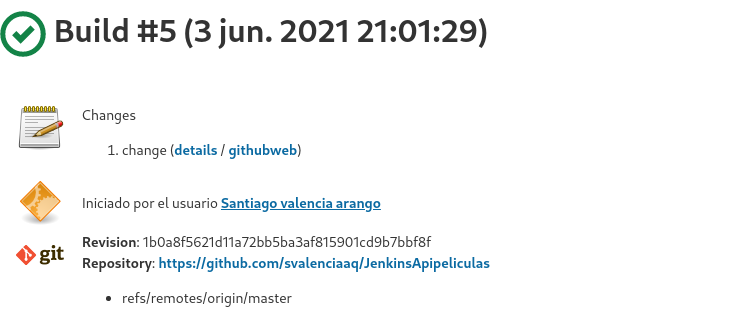
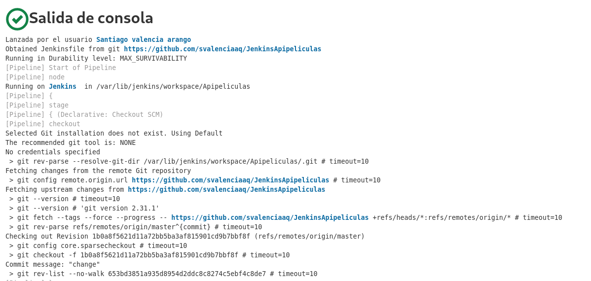
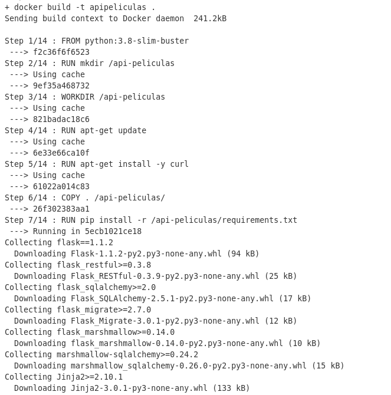
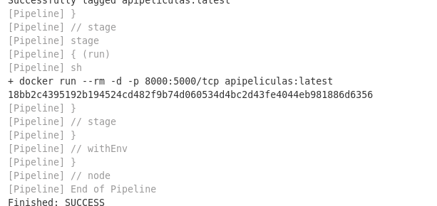
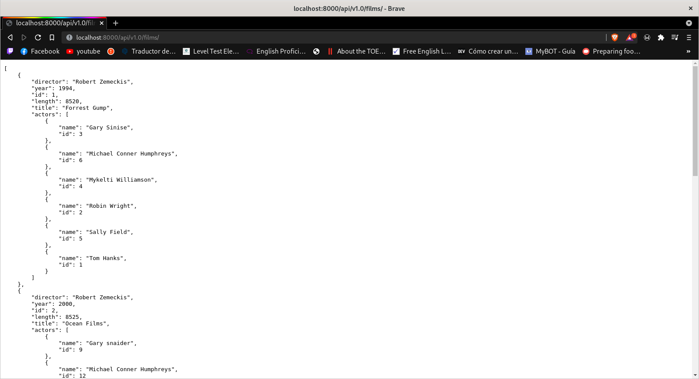
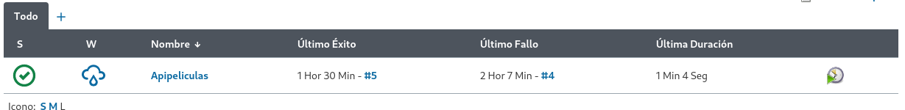

# **Jenkins** 

- [**Jenkins**](#jenkins)
  - [**Process**](#process)

## **Process**

To run jenkins it was necessary to create a Jenkisfile that could run docker automatically.

[**Jenkisfile**](Jenkinsfile)

After this the creation will run the jenkins file that is stored in the repository.

Start the pipeline execution process.

And it will start executing each of the steps that are inside the Dockerfile

ejecutara  y correra el contenedor con las instrucciones que les fueron dadas

You will see the application deployed on localhost

We will see the work on jenkins running effectively.
effectively

